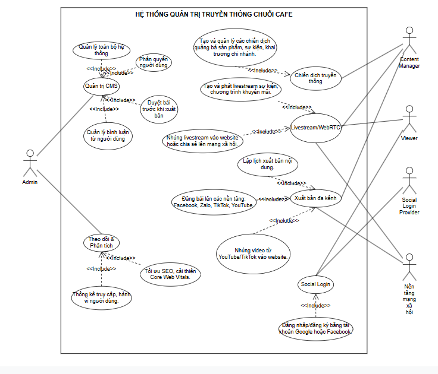
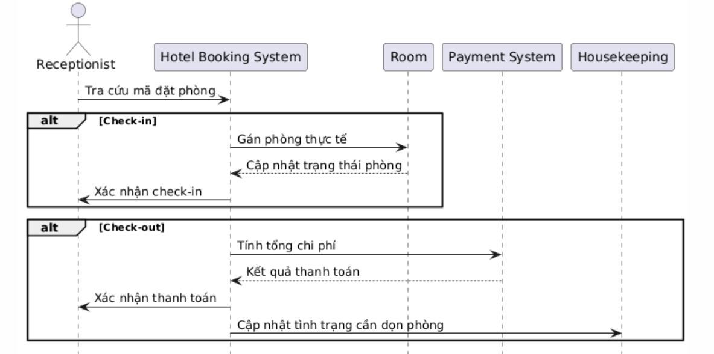
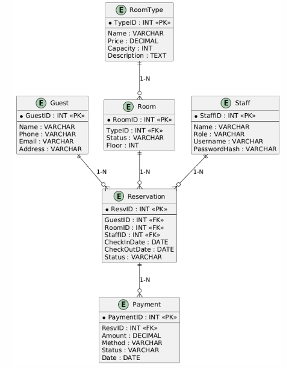

# Hotel Booking System – Lab 02

## 👤 Sinh viên
- Họ tên: Hồ Thị Cẩm 
- MSSV: N23DCPT007  
- Lớp: D23CQPTTK01-N  

## 🏨 Mô tả hệ thống
Hệ thống cho phép khách hàng đặt phòng, thanh toán online và lễ tân quản lý check-in/out.

## 📊 UML

## 📋 Link Jira Board
https://student-team-dycpkdi5.atlassian.net/jira/software/projects/ANH123/boards/37?atlOrigin=eyJpIjoiMjc1ZGI1NDQ5NmY3NDI5ODk3YmUyZWIwZmYzNjdkOTMiLCJwIjoiaiJ9
